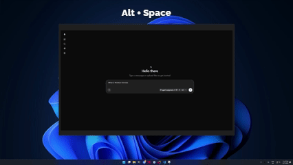

# Llama

**Local LLMs, one click away — right from your Windows system tray.**

Llama is a Windows 11 tray app for running [llama.cpp](https://github.com/ggml-org/llama.cpp) models locally. It's a WinUI 3 port of [Llama for Mac](https://github.com/ggml-org/Llama-macOS).


## Install

Grab the latest `.msixbundle` (x64 + ARM64) from [**Releases**](https://github.com/ggml-org/Llama-Windows/releases) and double-click to install.

## Highlights

- **Lives in your tray** — a borderless, Mica-backed flyout anchored to the tray icon
- **Zero-setup llama.cpp** — uses your existing `llama.exe`, or downloads one for you
- **One-click models** — browse and download recommended models from the Hugging Face Hub
- **Standard storage** — models live in the Hugging Face cache, shared with `llama.cpp` and other tools
- **Spotlight-like overlay** — press `Alt+Space` from any app to chat with your loaded model

## The overlay

`Alt+Space` from any app opens a borderless window with the WebUI for whichever model is loaded. It hides instead of closing, so re-summoning is instant and your conversation is still there.

<p align="center">
  
</p>

## How it works

Llama manages a `llama serve` process and talks to it over its REST API. Your models stay in the standard Hugging Face cache (`%USERPROFILE%\.cache\huggingface\hub`), shared with `llama.cpp` and HF tooling. Settings and logs live under `%LOCALAPPDATA%\Llama`.

## Building from source

You'll need the **.NET 10 SDK** with the Windows App SDK workload:

```bash
dotnet build -c Release -r win-x64   # or win-arm64
dotnet test                          # run the unit tests
```

---

Made with 🦙 for Windows 11 · Models run 100% locally — your prompts never leave your machine.
