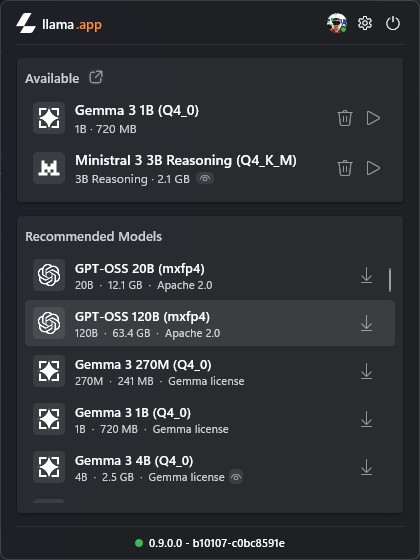
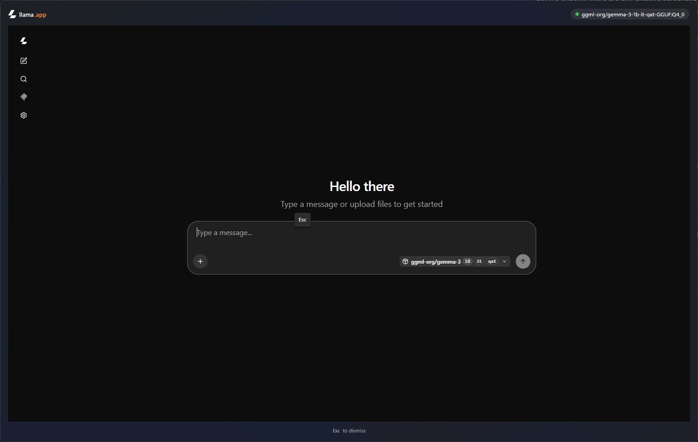

# Llama

**Local LLMs, one click away — right from your Windows system tray.**

Llama is a Windows 11 tray app for running [llama.cpp](https://github.com/ggml-org/llama.cpp) models locally. It's a WinUI 3 port of [Llama for Mac](https://github.com/ggml-org/Llama-macOS).

<p align="center">
  
</p>

## Install

Grab the latest `.msixbundle` (x64 + ARM64) from [**Releases**](https://github.com/ggml-org/Llama-Windows/releases) and double-click to install.

## Highlights

- **Lives in your tray** — a borderless, Mica-backed flyout anchored to the tray icon
- **Zero-setup llama.cpp** — adopts a running server, launches your existing `llama.exe`, or downloads one for you
- **One-click models** — browse recommended models from the Hugging Face Hub or load models you already have on disk
- **Spotlight-like overlay** — press `Alt+Space` from any app to chat with your loaded model

<p align="center">
  
</p>

## The overlay, up close

The overlay is the star of the show: a borderless Mica window (~60% of your screen) that embeds the llama server's WebUI for whichever model is loaded. Think Spotlight or Raycast, but for your local LLM.

<p align="center">
  
</p>

- **Global hotkey** — `Alt+Space` works from any app while Llama is running.
- **Model-aware** — automatically points at the currently loaded model; shows the router view when none is loaded.
- **Native feel** — hides instead of closing, so re-summoning is instant.

## How it works

Llama manages a `llama serve` process on `localhost:2276` and talks to it over its REST API. Your models stay in the standard Hugging Face cache (`%USERPROFILE%\.cache\huggingface\hub`), shared with `llama.cpp` and HF tooling. Settings and logs live under `%LOCALAPPDATA%\LlamaApp`.

## Building from source

You'll need the **.NET 10 SDK** with the Windows App SDK workload:

```bash
dotnet build -c Release -r win-x64   # or win-arm64
dotnet test                          # run the unit tests
```

---

Made with 🦙 for Windows 11 · Models run 100% locally — your prompts never leave your machine.
