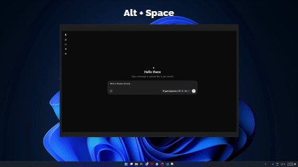

# Llama

**Local LLMs, one click away — right from your Windows system tray.**

Llama is a Windows 11 tray app for running [llama.cpp](https://github.com/ggml-org/llama.cpp) models locally. It's a WinUI 3 port of [Llama for Mac](https://github.com/ggml-org/Llama-macOS).


## Install

Grab the latest `.msixbundle` (x64 + ARM64) from [**Releases**](https://github.com/ggml-org/Llama-Windows/releases) and double-click to install.

## Highlights

- **Lives in your tray** — a borderless, Mica-backed flyout anchored to the tray icon
- **Zero-setup llama.cpp** — uses your existing `llama.exe`, or downloads one for you
- **One-click models** — browse and download recommended models from the Hugging Face Hub
- **Model details** — click any model for a context-length picker with per-option memory estimates (read from the GGUF header), remembered per model, plus chat, copy-model-ID, curl-request, and Hugging Face actions
- **Standard storage** — models live in the Hugging Face cache, shared with `llama.cpp` and other tools
- **Spotlight-like overlay** — press `Alt+Space` from any app to chat with your loaded model

## The overlay

`Alt+Space` from any app opens a borderless window with the WebUI for whichever model is loaded. It hides instead of closing, so re-summoning is instant and your conversation is still there.

<p align="center">
  
</p>

## How it works

Llama manages a `llama serve` process and talks to it over its REST API. Your models stay in the standard Hugging Face cache (`%USERPROFILE%\.cache\huggingface\hub`), shared with `llama.cpp` and HF tooling. Settings and logs live under `%LOCALAPPDATA%\Llama`.

## Privacy

Llama sends no telemetry — no events, no analytics, no install id. The only thing outbound HTTP requests (model downloads, release-update checks, and calls to the local llama-server) carry is the standard User-Agent header:

```
llama-win/0.12.0 (10.0.26100; x64)
```

— the app version, the Windows build, and the processor architecture. Prompts and inference stay 100% local.

## Building from source

You'll need the **.NET 10 SDK** on Windows (ARM64 or x64 host; the SDK cross-builds both).

The WinUI app is built per-platform — pass the matching `-p:Platform` alongside the `-r` runtime identifier:

```bash
dotnet build LlamaApp.csproj -c Release -r win-arm64 -p:Platform=ARM64
dotnet build LlamaApp.csproj -c Release -r win-x64   -p:Platform=x64
dotnet build LlamaApp.csproj -c Release -r win-x86   -p:Platform=x86

# run the unit tests (two test projects; see the ARM64 note below)
dotnet test LlamaApp.Tests/LlamaApp.Tests.csproj -c Release
dotnet test LlamaApp.LlamaCpp.Tests/LlamaApp.LlamaCpp.Tests.csproj -c Release

To get a runnable (unpackaged, loose-files) build, publish it. This is what
[`.github/workflows/publish.yml`](.github/workflows/publish.yml) produces:

```bash
dotnet publish LlamaApp.csproj -c Release -r win-arm64 -p:Platform=ARM64 \
    --self-contained true -p:PublishReadyToRun=false -p:PublishSingleFile=false \
    -o publish/win-arm64
```

The app runs unpackaged from that folder. Trim/R2R are off in the official
builds because the app relies on reflection-based JSON serialization and COM
`dynamic` interop, which the trimmer would strip (see the IL2026/IL2072
warnings if you enable `PublishTrimmed`).

**Testing on an ARM64 host:** `LlamaApp.Tests` references the WinUI app, which
the test project pins to x64 (`SetPlatform=Platform=x64`), so the app assembly
it loads is x64. On ARM64 Windows, run that suite under the x64 .NET runtime
(installed at `C:\Program Files\dotnet\x64`) with `--arch x64`:

```bash
dotnet test LlamaApp.Tests/LlamaApp.Tests.csproj -c Release --arch x64
```

`LlamaApp.LlamaCpp.Tests` is platform-agnostic and runs natively.

### Building the MSIX

The installed release is a signed `.msix`, produced by the CI
([`.github/workflows/_build.yml`](.github/workflows/_build.yml)) with Visual
Studio MSBuild and the `GenerateAppxPackage` target — `dotnet build` alone
does not pack the Appx. `dotnet publish` above is sufficient for local use.

---

Made with 🦙 for Windows 11 · Models run 100% locally — your prompts never leave your machine.
